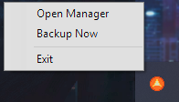
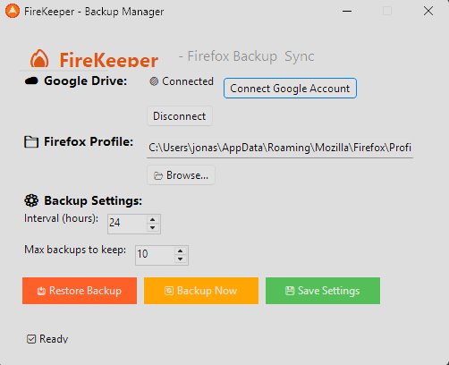

# 🔥 FireKeeper

[](https://github.com/yourusername/FireKeeper)
[](https://www.gnu.org/licenses/old-licenses/gpl-2.0.en.html)
[]()


> **FireKeeper** - A lightweight, resource-efficient Firefox backup utility that automatically syncs your profile to Google Drive.

---

## ✨ Features

- 🚀 **Lightweight** - ~5MB of RAM consumption, near-zero CPU when idle
- 🔄 **Automatic Backups** - Configurable schedule (default: every 24 hours)
- ☁️ **Google Drive Sync** - Cloud storage for backups
- 📁 **Smart Backup Selection** - Backs up only important files (bookmarks, passwords, history, extensions, settings)
- 🚫 **Excludes Unnecessary Files** - Automatically skips cache, .lock files, and temporary files
- 📥 **Restore from Backup** - One-click restore with automatic pre-restore backup
- 🔒 **Safety First** - Checks if Firefox is running before restoring
- 🎨 **System Tray Integration** - Runs silently in the background
- 🌍 **Default language** - English

---

## 🗺️ Roadmap & Planned Features

### Technical Improvements
- ✅ Verify and correct technical debt and possible security issues
- ✅ Add extensive testing
- ⬜ Add run on system start option
- ⬜ Update backups to allow auto-delete
- ⬜ Update backups to allow incremental backups
- ⬜ Update backups to allow backup retention policies
- ⬜ Update restore to allow restoration of only bookmarks, passwords, or settings
- ⬜ Add options GUI menu to avoid constant changes to json configs
- ⬜ Add backup integrity validation
- ⬜ Add backup compression level to option
- ⬜ Add other cloud providers
- ⬜ Add drag and drop of a backup file to restore
- ⬜ Add drag folder to set profile path

### UX Improvements
- ⬜ Add dark mode
- ⬜ Add system language support
- ⬜ Update UI renderer
- ⬜ Add progress bar
- ⬜ Add logging
- ⬜ Add progress tracking
- ⬜ Add custom tray notifications
- ⬜ Add step-by-step guide for new users

---

## 📋 Table of Contents

- [Installation](#-installation)
- [Setup Guide](#-setup-guide)
- [Configuration](docs/CONFIG.md)
- [Usage](docs/USAGE.md)
- [Building from Source](docs/BUILDING.md)
- [FAQ](docs/FAQ.md)
- [Contributing](docs/CONTRIBUTING.md)
- [License](#-license)

---

## 📸 Screenshots

### System Tray


### Main Interface


---

## 🚀 Installation

### Option 1: Download Pre-built Executable

1. Download the latest `FireKeeper.exe` from the [Releases](https://github.com/yourusername/FireKeeper/releases) page
2. Run the executable - no installation required!
3. The app will create a configuration folder at `%APPDATA%\FireKeeper\`

### Option 2: Build from Source

```bash
# Clone the repository
git clone https://github.com/yourusername/FireKeeper.git
cd FireKeeper

# Build
dotnet build -c Release -f net48

# Run
dotnet run
```

## ⚙️ Setup Guide

### 1. Google Drive Setup

1. Go to [Google Cloud Console](https://console.cloud.google.com/)
2. Create a new project (or select existing)
3. Enable the **Google Drive API**
4. Configure the **OAuth consent screen**:
   - App name: `FireKeeper`
   - User support email: your email
   - Scopes: `.../auth/drive.file`
   - Add your email as a **test user**
5. Create **OAuth Client ID** (Desktop app type)
6. Copy your **Client ID** and **Client Secret**

### 2. Configure FireKeeper

Rename `appsettings.example.json` (in the same folder as FireKeeper.exe) to `appsettings.json`.

Paste here your ClientId and ClientSecret generated from your OAuth:

```json
{
  "GoogleDrive": {
    "ClientId": "your_client_id.apps.googleusercontent.com",
    "ClientSecret": "your_client_secret"
  }
}
```

### 3. First Run

1. Launch FireKeeper.exe
2. Right click tray icon > Open Manager
3. Click "Connect Google Account"
4. Authorize the app in your browser
5. Done! Your Firefox profile will now be backed up automatically

---

## [📁 Configuration](docs/CONFIG.md)

## [🎯 Usage](docs/USAGE.md)

## [🏗️ Building from Source](docs/BUILDING.md)

## [❓ General Questions](docs/FAQ.md)

## [➕ How to Contribute](docs/CONTRIBUTING.md)

---

### Feature Requests

This is open to feature suggestions! Please:

- Check if the feature already exists
- Describe the feature clearly
- Explain why it would be useful
- Provide examples of usage

---

## 📝 License

### GNU General Public License v2.0 or later

Copyright (C) 2026 KretliJ

This program is free software: you can redistribute it and/or modify it under the terms of the GNU General Public License as published by the Free Software Foundation, either version 2 of the License, or (at your option) any later version.

This program is distributed in the hope that it will be useful, but WITHOUT ANY WARRANTY; without even the implied warranty of MERCHANTABILITY or FITNESS FOR A PARTICULAR PURPOSE. See the GNU General Public License for more details.

You should have received a copy of the GNU General Public License along with this program. If not, see https://www.gnu.org/licenses/.

### You are free to:

Use - Run FireKeeper for any purpose
Modify - Change the source code to suit your needs
Share - Distribute copies of FireKeeper
Distribute - Share your modified versions

### Under these conditions:

Attribution - You must keep the original copyright notice
ShareAlike - Any modifications must be released under the same license
Open Source - Source code must be provided when distributing
No Proprietary Use - Cannot be used in proprietary/closed-source software

### Additional Information

The full license text is available in the LICENSE file.

Why GPL v2?

- Protects against proprietary use
- Ensures improvements remain open source
- Gives users freedom to use, modify, and share
- Compatible with most open source projects

For Commercial Use

- Internal use: Any company can use FireKeeper internally
- Support services: Companies can charge for support/installation
- Reselling: Cannot sell FireKeeper as a proprietary product
- Closed-source: Cannot incorporate into closed-source software

---
