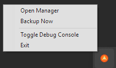
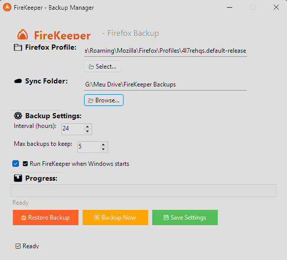

# 🔥 FireKeeper

[](https://github.com/yourusername/FireKeeper)
[](https://www.gnu.org/licenses/old-licenses/gpl-2.0.en.html)
[]()
[]()


> **FireKeeper** - A lightweight, resource-efficient Firefox backup utility that automatically syncs your profile to anywhere you choose.

---

## ✨ Features

- 🚀 **Lightweight** - ~53MB of RAM consumption, near-zero CPU when idle
- 🔄 **Automatic Backups** - Configurable schedule (default: every 24 hours)
- ⏰ **Pending Backup on Startup** - Missed backups run automatically when the app starts
- 📁 **Smart Backup Selection** - Backs up only important files (bookmarks, passwords, history, extensions, settings)
- 🚫 **Excludes Unnecessary Files** - Automatically skips cache, .lock files, and temporary files
- 📥 **Restore from Backup** - One-click restore with automatic pre-restore backup
- 🎨 **System Tray Integration** - Runs silently in the background
- 🚀 **Run on Startup** - Option to start automatically with Windows
- 📊 **Progress Bar** - Visual feedback during backup and restore operations
- 🐛 **Debug Console** - Toggle on/off from tray menu for troubleshooting
- 🌍 **Default language** - English

---

## 🔄 Version History

| Version | Breaking change / Minor / Patch                                                                                         | Status                                |
| ------- | ----------------------------------------------------------------------------------------------------------------------- | ------------------------------------- |
| 1.0.0   | Initial commit with basic functionality                                                                                 | Deprecated                            |
| 1.0.1   | Built-in Google Drive OAuth                                                                                             | [Legacy](docs/LEGACY.md) / Deprecated |
| 2.0.0   | OAuth dropped for Universal sync folder, progress bar, debug console, clickable notifications, multi-profile selection | Superseded                            |
| 2.1.0   | Quality of Life Update: Testing, refactor to .NET 10, improved project structure, fixed minor bugs                     | Superseded                            |
| 2.2.0   | Revamped visual in favor of more modern visual. Refactored project structure. Functionality not affected               | **Active**                      |

---

## 🗺️ Roadmap & Planned Features

### Technical Improvements

- ⬜ Verify and correct technical debt and possible security issues
- ✅ Add extensive testing (28 unit tests + 8 integration tests)
    - Last testing run - 2.1.0 
- ✅ Double-click tray icon opens manager (Implemented 1.0.1)
- ✅ Run on system start option (Implemented 2.1.0)
- ✅ Auto-delete old backups (Implemented 2.0.0)
- ⬜ Incremental backups
- ✅ Backup retention policies (Implemented 2.0.0)
- ⬜ Selective restore (bookmarks only, passwords only, etc.)
- ✅ GUI options menu (superseded by dynamic configs in 2.0.0)
- ⬜ Backup integrity validation
- ⬜ Backup compression level option
- ✅ Other cloud providers (superseded by architecture change in 2.0.0)
- ⬜ Drag and drop backup file to restore
- ❌ Drag folder to set profile path (superseded by 2.0.0 architectural changes)

### UX Improvements

- ⬜ Dark mode
- ⬜ System language support
- ✅ UI renderer update
- ✅ Progress bar (Implemented 2.0.0)
- ✅ Debug logging (Implemented 2.0.0)
- ✅ Progress tracking (Implemented 2.0.0)
- ⬜ Custom tray notifications
- ⬜ Step-by-step guide for new users
- ✅ Clickable notifications (Implemented 2.0.0)

---

## 📋 Table of Contents

- [Installation](#-installation)
- [Resource Consumption](#-system-resource-consumption)
- [Configuration](docs/CONFIG.md)
- [Usage](docs/USAGE.md)
- [Building from Source](docs/BUILDING.md)
- [Testing](docs/TESTING.md)
- [FAQ](docs/FAQ.md)
- [Contributing](docs/CONTRIBUTING.md)
- [Use of AI](docs/AI_ATTRIBUTION.md)
- [License](#-license)

---

## 📸 Screenshots

### System Tray



### Main Interface



---

## 🚀 Installation

### Option 1: Download Pre-built Executable

1. Download the latest `FireKeeper.exe` from the [Releases](https://github.com/yourusername/FireKeeper/releases) page
2. Run the executable - no installation required!
3. The app will create a configuration folder at `%APPDATA%\FireKeeper\`

### Option 2: Build from Source

```bash
# Clone the repository
git clone https://github.com/yourusername/FireKeeper.git
cd FireKeeper

# Build
dotnet build -c Release -f net10.0-windows

# Run
dotnet run
```

---

## 💻 System Resource Consumption

| Metric                | Value                                                       |
| --------------------- | ----------------------------------------------------------- |
| Background RAM        | ~53 MB                                                      |
| Backup RAM            | ~71 MB                                                      |
| Restore RAM           | ~76 MB                                                      |
| Disk Read/Write Speed | May vary with hardware                                      |
| CPU Usage (idle)      | Near 0.1%. May vary with hardware                           |
| CPU Usage (backup)    | Temporary spikes during compression. May vary with hardware |

FireKeeper is designed to be lightweight and run silently in the background without significantly impacting your system performance.

---

### Feature Requests

This is open to feature suggestions! Please:

- Check if the feature already exists
- Describe the feature clearly
- Explain why it would be useful
- Provide examples of usage

---

## ⚠️ IMPORTANT WARNING

FireKeeper backs up your **entire Firefox profile**, including passwords, sessions, and cookies.

🔒 **Treat your backup files like your house keys.**

DO NOT share your backups with anyone, upload them to public storage, or leave them in shared computers.

**What happens when you restore?**

- Some sites will keep you logged in (forums, dev tools, LLM SaaS)
- Some sites (as they should) will ask you to log in again (Google, Meta, banks)
- This is a **security feature**, not a failure

If someone else gets your backup, they can access everything in your browser.

**You are responsible for your own data. FireKeeper is a tool. Use it wisely.**

## 📝 License

### GNU General Public License v2.0 or later

Copyright (C) 2026 KretliJ

This program is free software: you can redistribute it and/or modify it under the terms of the GNU General Public License as published by the Free Software Foundation, either version 2 of the License, or (at your option) any later version.

This program is distributed in the hope that it will be useful, but WITHOUT ANY WARRANTY; without even the implied warranty of MERCHANTABILITY or FITNESS FOR A PARTICULAR PURPOSE. See the GNU General Public License for more details.

You should have received a copy of the GNU General Public License along with this program. If not, see https://www.gnu.org/licenses/.

### You are free to:

Use - Run FireKeeper for any purpose
Modify - Change the source code to suit your needs
Share - Distribute copies of FireKeeper
Distribute - Share your modified versions

### Under these conditions:

Attribution - You must keep the original copyright notice
ShareAlike - Any modifications must be released under the same license
Open Source - Source code must be provided when distributing
No Proprietary Use - Cannot be used in proprietary/closed-source software

### Additional Information

The full license text is available in the LICENSE file.

Why GPL v2?

- Protects against proprietary use
- Ensures improvements remain open source
- Gives users freedom to use, modify, and share
- Compatible with most open source projects

For Commercial Use

- Internal use: Any company can use FireKeeper internally
- Support services: Companies can charge for support/installation
- Reselling: Cannot sell FireKeeper as a proprietary product
- Closed-source: Cannot incorporate into closed-source software

---
